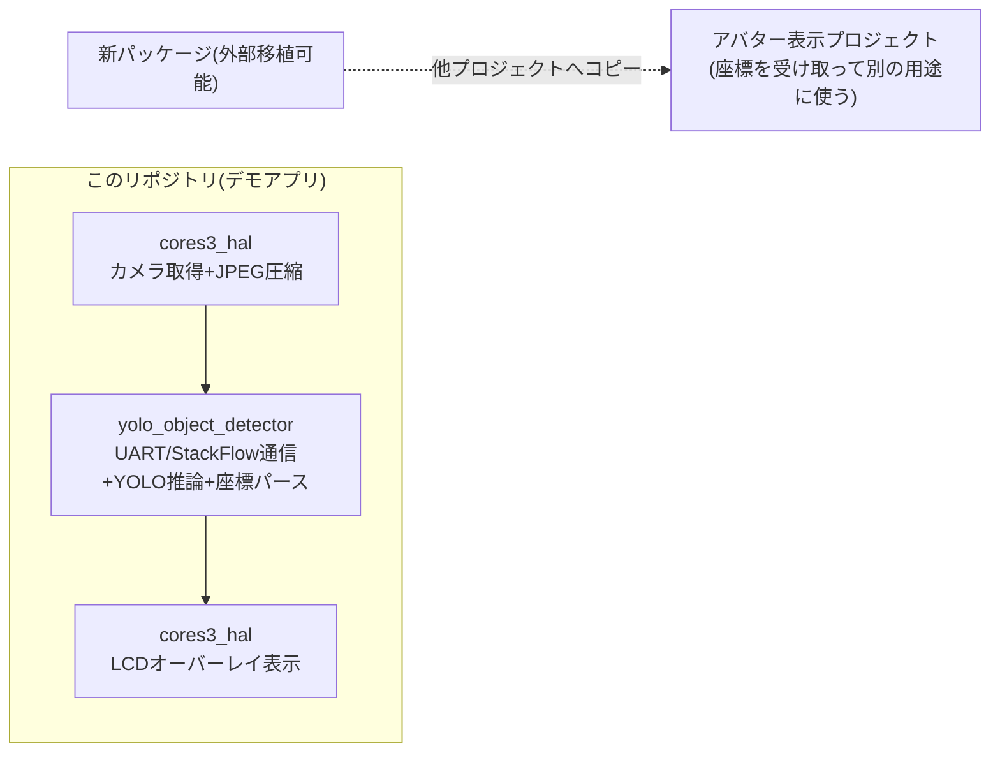

# YOLO物体座標検出の外部移植可能パッケージ化 計画

## 目的・背景

現在のファームウェアは「カメラ映像取得→YOLO推論→バウンディングボックス+ラベルをLCDに重畳表示」まで
一体になっている。これを次の2層に分離し、**検出処理(カメラ映像IN→物体座標OUT)だけを他プロジェクト
(アバター表示処理など)に移植可能なパッケージ**として切り出したい。

- **パッケージ化する部分**: JPEG画像を受け取り、Module LLM(YOLO)で推論し、検出物体の座標列を返すだけの処理
- **このリポジトリに残る部分**: CoreS3のカメラキャプチャ・JPEG圧縮・LCDへのライブ映像+検出枠のオーバーレイ表示
  (=このパッケージを使う「デモアプリ」という位置づけになる)

本ドキュメントは、この分離作業を各担当エージェントに委譲するための作業指示書。**CLAUDE.mdのエージェント
委譲ルールに従い、`src/hal/`・`src/llm/`・`src/main.cpp`への実装変更はメインセッションが直接行わず、
下記「実施手順」に従って対応エージェントへAgent toolで委譲すること。**

## 現状の境界(確認済み)

調査の結果、`src/llm/module_llm.h`(`vlmapp::ModuleLlmClient`)は**すでに`src/hal/`に依存していない**。
JPEGバイト列を引数で受け取り、`YoloDetection`(class_name/confidence/x1,y1,x2,y2)のリストをコールバックで
返すだけの設計になっている。つまり「カメラ映像IN→座標OUT」の契約自体はすでにほぼ出来上がっており、
今回の作業は主に**物理的な切り出し(パッケージ化)とAPIの一般化**が中心になる。



## 新パッケージの契約(INPUT/OUTPUT)

- **INPUT**: JPEG圧縮済み画像バイト列 + 長さ(`const uint8_t*`, `size_t`)。カメラドライバやJPEG圧縮方式には
  依存しない(呼び出し側が用意する)
- **OUTPUT**: 検出物体のリスト。各要素は `{class_name, confidence, x1, y1, x2, y2}`(入力画像のピクセル空間、
  対角コーナー座標。座標系の正式仕様は[open_questions.md](open_questions.md)参照)
- **含める**: UART接続ライフサイクル(`begin`/`connectAutoBaud`/`resetModule`/`setBaudRate`)、
  `yolo.setup`/`yolo.inferenceAndWaitResult`呼び出し、検出結果JSONのパース
- **含めない**(=このリポジトリ側に残す): カメラキャプチャ・JPEG圧縮(GC0308/esp32-camera依存)、
  LCD描画・オーバーレイ、ボタン/タッチ入力

この境界により、パッケージの依存は「UART」「M5Module-LLM Arduinoライブラリ」「Module LLMハードウェア」
のみになり、カメラやディスプレイを持たない/異なる構成のプロジェクト(アバター表示処理側)からも
「画像を渡して座標を受け取る」用途で再利用できる。

## 物理配置とパッケージング方法

`src/llm/module_llm.h/.cpp` を PlatformIOのローカルライブラリとして `lib/yolo_object_detector/` 配下へ
移動する(PlatformIOは`lib/*`配下を自動的にライブラリとして認識する)。

```
lib/yolo_object_detector/
  library.json          # 新規作成。name/version/dependencies(M5ModuleLLM等)を明記
  src/yolo_object_detector.h
  src/yolo_object_detector.cpp
  README.md             # このパッケージ単体のINPUT/OUTPUT契約・依存関係・使い方を記載
                         # (docs/module_llm_api.mdの内容をベースに、他プロジェクトへコピーしても
                         #  読めるよう自己完結させる)
```

こうすることで、他プロジェクトへ移植する際は `lib/yolo_object_detector/` フォルダを丸ごとコピーし、
`platformio.ini`に`M5ModuleLLM`(および依存する`ArduinoJson`等)の`lib_deps`を追加するだけで動く状態を目指す。

**命名について**: 現行の名前空間`vlmapp`はVLM時代の名残であり誤解を招くため、`yolo_object_detector`
(または同等の一般名)へリネームすることを推奨する。実装エージェントの判断で適切な名前を選んでよいが、
「VLM」「app」等アプリ固有の語は避けること。

## 公開API(たたき台)

現行の`ModuleLlmClient`/`YoloDetection`をほぼそのまま踏襲し、名前のみ一般化する案:

```cpp
namespace yolo_object_detector {

struct DetectedObject {
    String class_name;
    float confidence = 0.0f;
    int x1 = 0, y1 = 0, x2 = 0, y2 = 0;  // 入力JPEG画像のピクセル空間、対角コーナー座標
};

class Detector {
public:
    bool begin(HardwareSerial& serial, uint32_t baud_rate = 115200);
    void connectAutoBaud();
    void resetModule();
    bool setBaudRate(uint32_t baud_rate);
    bool setupYolo(const String& model = kDefaultYoloModel);
    bool isReady() const;

    bool detect(const uint8_t* jpeg_data, size_t jpeg_len,
                const std::function<void(const DetectedObject&)>& onDetection,
                uint32_t timeout_ms = 500);
};

}  // namespace yolo_object_detector
```

既存の`detectObjects()`は`detect()`へリネームする案だが、呼び出し元(`src/main.cpp`)への影響が大きい場合は
既存名を維持してもよい。実装エージェントの判断に委ねる。

## このリポジトリ側(デモアプリ)に必要な変更

- `src/main.cpp`: `#include "llm/module_llm.h"` を新パッケージのヘッダに差し替え、`ModuleLlmClient`を
  新APIに置き換えるだけで、ループの構造(撮影→検出→オーバーレイ表示→解放)自体は変更不要
- `src/hal/`: 変更不要の見込み(カメラ/JPEG/オーバーレイ表示は現状のまま)。ただし
  パッケージのAPI変更に伴い呼び出し側の型が変わる場合はvlm-appから連携する
- `platformio.ini`: `lib_deps`にあった`M5ModuleLLM`等はパッケージの`library.json`側の依存宣言に移すか、
  重複してもよいので明記したままにするか、実装時に確認する

## 未決事項(実装時に判断・docs/open_questions.mdへ反映)

- UART RX/TXピンは現状`M5.getPin(port_c_rxd/txd)`で自動解決しており、これはM5Unified依存(≒M5Stack製品
  前提)になっている。他プラットフォームへの移植可能性を広げるなら、明示的なピン番号を渡せる
  オーバーロードを追加し、`M5.getPin()`自動解決はデフォルト引数/別関数として残す設計を検討する
- パッケージの配布形態: 同一モノレポ内の`lib/`に留めるか、将来的に独立したgitリポジトリ/GitHubパッケージに
  分離するかは未定。当面は`lib/`配下への切り出しで「フォルダごとコピー」できる状態にすることを最低ラインとする
- 座標系(`[x1,y1,x2,y2]` vs `[x,y,w,h]`)の実機検証は[open_questions.md](open_questions.md)に既存項目あり。
  パッケージの公開契約として確定させる際は必ずこの項目を先に解消すること

## 実施手順(エージェント委譲、CLAUDE.md準拠)

1. **[[module-llm-protocol]]** に委譲: `src/llm/module_llm.h/.cpp` を `lib/yolo_object_detector/` へ移動し、
   上記の公開API・`library.json`・README.mdを整備する。ピン解決の一般化(未決事項)もここで判断する
2. 1と並行/後続で **[[vlm-app]]** に委譲: `src/main.cpp`のincludeとクライアント呼び出しを新パッケージに追従させる
3. **[[cores3-hal]]** への委譲は現時点では不要見込みだが、vlm-app側から型変更の要望が出た場合はそちらへ依頼する
4. 実装完了後、**必ず`pio-build-check`と`cpp-code-review`の両方**を呼び、ビルドとコード品質を確認する
5. 各エージェントは作業中に本ドキュメントの「未決事項」が確定したら[open_questions.md](open_questions.md)を、
   新たな不具合を直したら[known_issues.md](known_issues.md)を更新する
6. `.claude/agents/module-llm-protocol.md`の「担当範囲」は現在`src/llm/`と明記されているため、パッケージ移動後は
   `lib/yolo_object_detector/`に更新すること(CLAUDE.mdの「エージェント定義が実装とズレたら先に直す」ルールに従う)
7. [architecture.md](architecture.md)・[module_llm_api.md](module_llm_api.md)も新しい配置・API名に合わせて更新する
   (module_llm_api.mdはパッケージ側README.mdへの統合・リダイレクトに変更してもよい)

## 参考

- 現状のAPI一覧: [module_llm_api.md](module_llm_api.md)
- コード構成: [architecture.md](architecture.md)
- 未確定事項: [open_questions.md](open_questions.md)
- 既知の不具合: [known_issues.md](known_issues.md)
