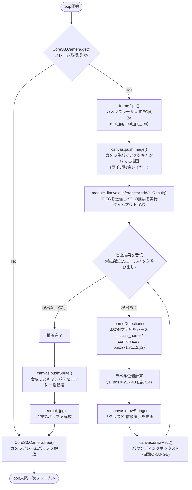

# reference/yolo_example.ino の loop() 処理

`reference/yolo_example.ino`(YOLO物体検知の一次情報)の`loop()`が毎フレーム何を行っているかを図式化する。

## 処理概要

1. **カメラフレーム取得**(`CoreS3.Camera.get()`) — 取得できた時だけ以下を実行
2. 取得したフレームを**JPEGに変換**(`frame2jpg`、YOLO推論用の入力データ)
3. フレームの生バッファ(RGB565)を**キャンバスに描画**(ライブ映像レイヤー)
4. JPEGデータをYOLOモジュールに送信して**推論**(`inferenceAndWaitResult`、タイムアウト10秒)
   - 検出結果が返るたびに**コールバックが呼ばれ**、JSONをパースして「クラス名+信頼度」ラベルと
     **バウンディングボックス**をキャンバスに重ね描きする
5. 完成したキャンバスを**LCDへ一括転送**(`pushSprite`、ちらつき防止)
6. JPEGバッファとカメラフレームバッファを解放して次フレームへ

## フローチャート

## ポイント

- **カメラ生画像**(RGB565)と**JPEG**を両方使っている。前者はライブ映像描画用、後者はYOLO推論への
  入力用として別々に用意している。
- ラベル・ボックス描画はキャンバス上に**カメラ画像を描いた後**に重ね書きするので、映像とオーバーレイが
  1枚の`canvas`に合成されてから`pushSprite`で一括表示される(ちらつき防止のダブルバッファ的な使い方)。
- `y1 - 40`のオフセットは、ラベル文字列を検出ボックスの少し上に表示するための調整。`drawRect`側にも
  同じ`-40`補正が入っており、bbox座標系とキャンバス座標系の間にオフセットがあることが伺える。

## 関連ドキュメント

- 実機確認済みリファレンス: `reference/yolo_example.ino`
- 通信プロトコル・実績のあるAPI呼び出し順序: [protocol.md](protocol.md)
- コード構成・`src/main.cpp`のステートマシン: [architecture.md](architecture.md)
